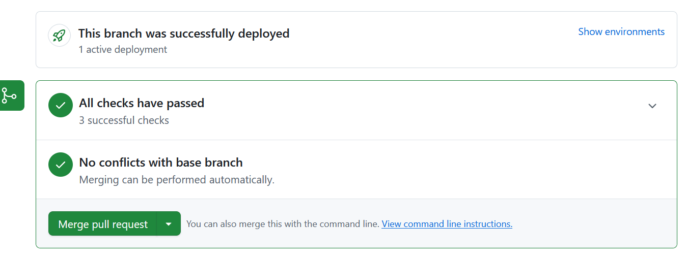

# Tarea 1: flujo de trabajo de solicitud de cambios de GitHub.

## Parte 1:
- Crea un repositorio "soy_TUNOMBRE" que tenga un fichero README. El repositorio será público. Para crear un repositorio, seguir los pasos indicados en la url https://docs.github.com/es/pages/getting-started-with-github-pages/creating-a-github-pages-site#creating-your-site:
- Crea una rama nueva de nombre  "contenido-web". Sigue los pasos del aptdo Publicacion desde una rama en https://docs.github.com/es/pages/getting-started-with-github-pages/configuring-a-publishing-source-for-your-github-pages-site#publishing-from-a-branch
- Cámbiate a esa rama y crea un fichero index.html con el siguiente contenido:
```
<div class="text_to_html">Ola Susana<br /> <br /> ¿Dache o problema tanto ao arrastrar o ficheiro ao rectángulo punteado como premendo no botón de "Haga clic para subir archivos" e seleccionando o arquivo no explorador?</div>
<div class="text_to_html">Se queres podo subir o csv a unha folla de cálculo de Google Sheets, compártocha e cargas os datos dende esa folla de cálculo, a ver se así vai...<br /> <br /> Un saúdo</div>

```
- Confirma los cambios en el fichero. Comprueba que estos cambios sólo afectan a la rama "contenido-web" pero no a a principal.
- Ahora vamos a crear en el repositorio un [servidor web estático](Website.md)

## Parte 2:
Vamos a fusionar los cambios en la rama webb respecto a la rama principal (fichero index.html). Para ello:
- Cambiar a la rama webb.
- Pulsamos el botón Contribute y seleccionamos la opción Compare para ver las diferencias con la otra rama.
- Pulsamoa creata pull request para lanzar la solicitud de cambios a la rama principal.
- En la descripción del cambio, indicamos que queremos fusionar la rama webb con la rama principal.
- Si todo va bieb, nos indica que quiere fusionar los cambios relaizafos en la rama webb con la rama orincipal.

- Pulsamos el botón Merge y confirmamos Merge, el resultado debería ser:
  
- Nos dice que podemos borrar la rama webb con seguridad porque los cambios de esa rama (el index.html) ya están en la rama principal
- Harás cambios a un archivo y los subirás a GitHub como confirmaciones.
    Abre y fusiona una solicitud de cambios.


    
