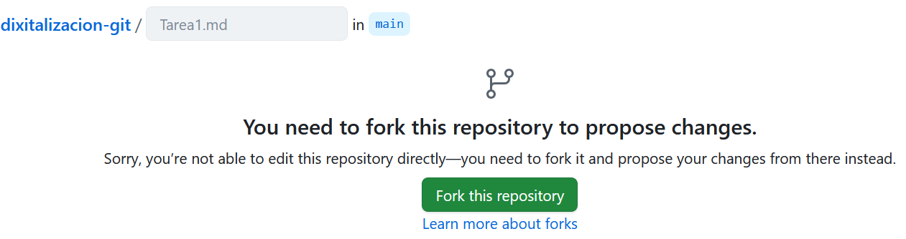
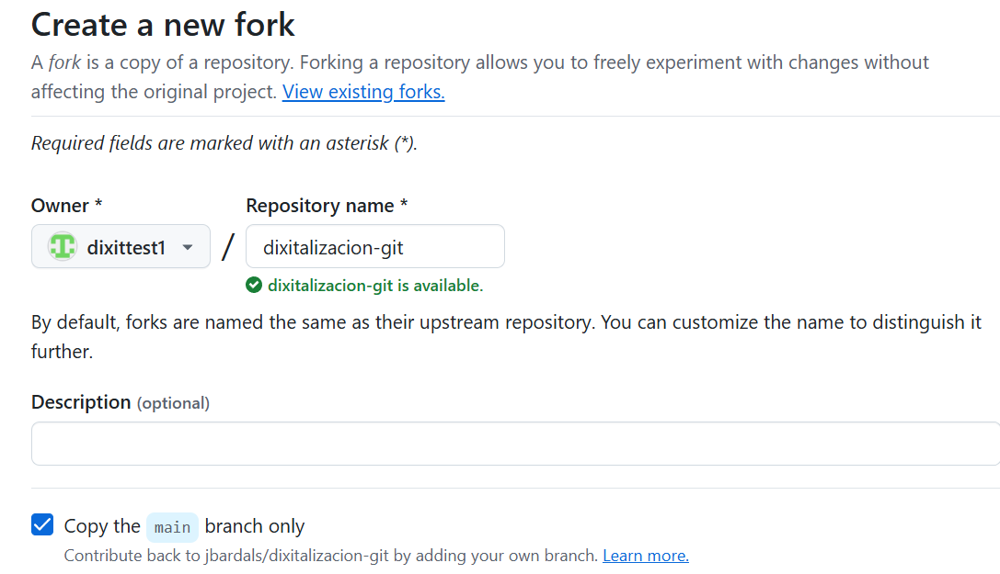
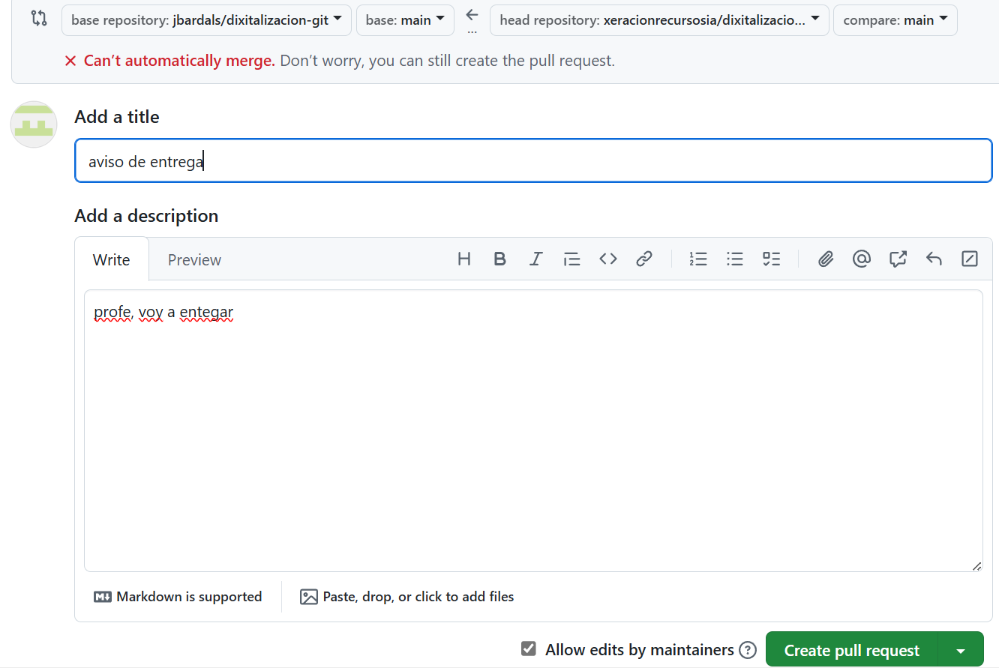

## Trabajo colaborativo con forks y pull requests

Por si no te has dado cuenta, tú sólo tienes permisos de lectura sobre los contenidos de este repositorio.

Qué sucede si intentas crear o editar un fichero en el repositorio y guardar los cambios? Te indica que tienes que realizar un fork:

Yo ahora, como profesor, quiero que realices en este repositorio la entrega de las tareas propuestas en el repositorio pero sin que puedas modificar o editar los contenidos del repositorio. Para ello te voy a pedir que realices los siguientes pasos:
- Haz un fork de este repositorio.
  
  A partir de este momento todas las tareas que se indican a continuación se realizarán en tu repositorio (el que has clonado mediante el fork).
- Ya en tu repositorio clonado: Edita el fichero Entrega.md y añade los siguientes datos:
    - tu nombre y apellidos
    -  url de tu repositorio.
- Realiza un commit de los cambios del fichero en tu repositorio.
- Haz una captura de pantalla de los comandos que has utilizado para hacer los commits y subir los cambios a GitHub.
- Incluye las capturas de pantalla en el repositorio dentro de la carpeta capturas. Añádelas también al repositorio de manera que queden guardadas en tu repositorio en GitHub.
- Realiza una pull request indicando en el mensaje que has completado la tarea.
  
- A mí me llega un aviso de entrega como éste:
 

## Entrega

crearse el fork del mio, añadir un fichero url_GithubPages y hacer push

Metodologías de trabajo para prácticas individuales

Existen dos posibilidades: utilizando exclusivamente GitHub mediante forks y pull requests o utilizando GitHub Classroom. En ambos casos es recomendable crear una organización para cada clase que impartamos. La organización puede darse de alta para solicitar el descuento educativo tal como vimos en la sesión 3. Dentro de la organización se crearán los repositorios para cada tarea.
1. Forks y Pull Requests

    Creación del repositorio con el código base de la tarea
    Archivo README con enunciado o descripción de la tarea
    Cada alumno realiza un fork del repositorio
    El alumno trabaja en su copia del repositorio
    Cuando quiera solicitar ayuda o revisión del profesor, el alumno genera una pull request
    El profesor proporciona retroalimentación mediante comentarios en la pull request o en un determinado commit individual
    Opcionalmente se pueden utilizar los issues y las citas de usuario para solicitar la intervención del profesor
    Los comentarios se pueden realizar a nivel de línea de código
    Cuando el alumno finaliza la tarea, genera una pull request
    El profesor revisa la pull request y opcionalmente hace comentarios sobre la misma
    Al finalizar, el profesor cierra la pull request

Ventajas

    Sencillez
    Flujo de trabajo parecido al funcionamiento normal de GitHub

Desventajas

    Los repositorios de las tareas de los alumnos son públicos
    Es difícil determinar el nombre del alumno a partir del usuario de GitHub
    Cada alumno es dueño de su repositorio
    En caso de tener integración con Travis, cada alumno deberá activarla en su repositorio

