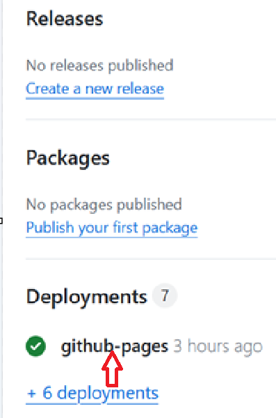

## Creación de sitios web en GitHub

GitHub es un servicio muy interesante porque ofrece alojamiento gratuito para sitios estáticos. Tenemos a nuestra disposición varias opciones para publicar documentación:

- Utilizar directamente GitHub. Es la opción más sencilla. Se pueden crear una serie de archivos en formato markdown u orgmode con enlaces relativos entre ellos. Al acceder a través de GitHub los archivos se visualizarán con el formato correcto (negrita, cursiva, encabezados, código,…). Un ejemplo es el repositorio de este curso. Los archivos estarán accesibles a través de https://github.com.
- Utilizar GitHub Pages con el tema por defecto de Jekyll. La segunda opción consiste en activar GitHub Pages en el repositorio que estemos utilizando y añadir archivos en formato HTML o markdown. Los archivos se publicarán en la ruta correspondiente al repositorio utilizado y el nombre de archivo usado. Los archivos con nombre index serán accesibles a través de la carpeta contenedora: así, un archivo index.html dentro de la carpeta pagina1 estará accesible a través de la URL https://MINOMBREDEUSUARIO.github.io/nombrerepositorio/pagina1/; un archivo con nombre a1.html dentro de la misma carpeta será visible en https://MINOMBREDEUSUARIO.github.io/nombrerepositorio/pagina1/a1.html. Si utilizamos enlaces relativos podremos construir un sitio estático formado por todos los archivos.

Características de GitHub Pages
- Servicio de alojamiento web estático (sin lógica de servidor ni base de datos).
- Hasta 1 GB de alojamiento (ver límites de uso).
- Tecnologías que se pueden utilizar: HTML, CSS y JavaScript. También se puede publicar cualquier otro tipo de archivos para su descarga vía web (PDF, DOC, ZIP,…)

Se puede crear un sitio web asociado a cualquier repositorio. Algunos ejemplos de uso:

- Documentación relacionada con el código del repositorio
- Trabajos o presentaciones de alumnos
-  ...

En la sección Settings -> Pages de tu repositorio TUNOMBRE:
- Selecciona la rama webb y la carpeta root , ya que el fichero index.html se ubica en la raíz del repositorio. Si lo huiberas creado dentro de una carpeta, tendrías que seleccioanr dicha carpeta.
- 
  En la pagina principal del repositorio, busca abajo a la derecha la sección Deployments y pulsa en github-pages.
  https://TUNOMBREDEUSUARIO.github.io/nombrerepositorio.
  

Incluye un fichero index.html con tu nombre y tus apellidos. Comprueba que puedes acceder vía web al sitio publicado.
