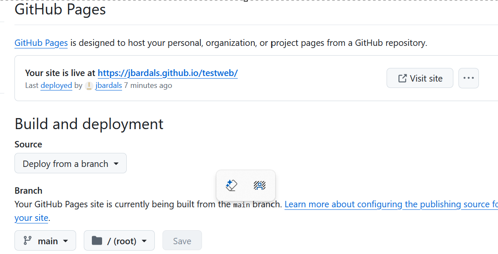
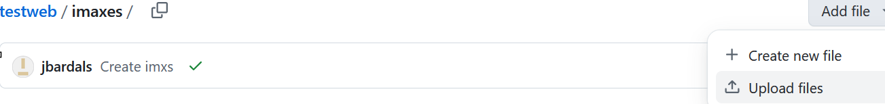

## Creación de sitios web en GitHub

GitHub es un servicio muy interesante porque ofrece alojamiento gratuito para sitios estáticos. 
Características principales de GitHub Pages:
- Servicio de alojamiento web estático (sin lógica de servidor ni base de datos).
- Hasta 1 GB de alojamiento (ver límites de uso).
- Tecnologías que se pueden utilizar: HTML, CSS y JavaScript. También se puede publicar cualquier otro tipo de archivos para su descarga vía web (PDF, DOC, ZIP,…)

Tenemos a nuestra disposición varias opciones para publicar documentación:

- Utilizar directamente GitHub. Es la opción más sencilla. Se pueden crear una serie de archivos en formato markdown u orgmode con enlaces relativos entre ellos. Al acceder a través de GitHub los archivos se visualizarán con el formato correcto (negrita, cursiva, encabezados, código,…). Un ejemplo es el repositorio de este curso. Los archivos estarán accesibles a través de https://github.com.
- Utilizar GitHub Pages con el tema por defecto de Jekyll. La segunda opción consiste en activar GitHub Pages en el repositorio que estemos utilizando y añadir archivos en formato HTML o markdown. Los archivos se publicarán en la ruta correspondiente al repositorio utilizado y el nombre de archivo usado. Los archivos con nombre index serán accesibles a través de la carpeta contenedora: así, un archivo index.html dentro de la carpeta pagina1 estará accesible a través de la URL https://MINOMBREDEUSUARIO.github.io/nombrerepositorio/pagina1/; un archivo con nombre a1.html dentro de la misma carpeta será visible en https://MINOMBREDEUSUARIO.github.io/nombrerepositorio/pagina1/a1.html. Si utilizamos enlaces relativos podremos construir un sitio estático formado por todos los archivos.

Se puede crear un sitio web asociado a cualquier repositorio. Algunos ejemplos de uso:

- Documentación relacionada con el código del repositorio
- Trabajos o presentaciones de alumnos
-  ...

Para crear un sitio web para tu cuenta de usuario de Github, en la sección Settings -> Pages de tu repositorio TUNOMBRE:
- Selecciona la rama webb y la carpeta root , ya que el fichero index.html se ubica en la raíz del repositorio. Pulsa el botón Save.
  
  En la pagina principal del repositorio, busca abajo a la derecha la sección Deployments:
  - Pulsa en github-pages. Verás que aparece como desplegada en el entorno github-pages la url https://TUNOMBREDEUSUARIO.github.io/nombrerepositorio.
  

Comprueba que puedes acceder vía web al sitio publicado en la url https://TUNOMBREDEUSUARIO.github.io/nombrerepositorio.

## Entrega 1.1
- Realiza una captura de la pantalla de la configuración de tu repositorio en Settings -> Pages mostrando la url del website y la rama de desplieue.

- Guarda la imagen capturada en un fichero de imagen con el nombre Entrega11
- Sube el fichero a la carpeta de imaxes. Para ello, desde la carpeta de imaxes seleccionamos la opción upload file

y subimos el fichero Entrega11

Continuamos con la parte 2 de la [tarea1](Tarea1.md)

